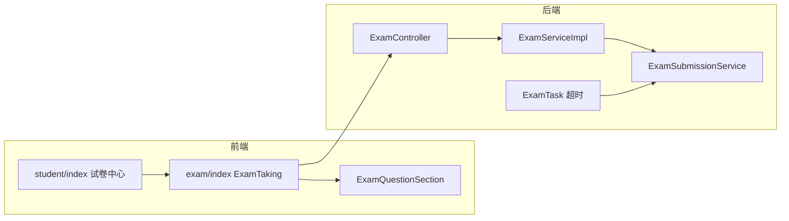

# 在线考试系统 - 项目结构文档

**更新日期**：2026-05-22  
**技术栈**：Spring Boot 3 + Java 17 / Vue 3 + Element Plus + Vite

---

## 一、项目概述

在线考试系统为前后端分离架构，支持管理员、教师、学生三类角色，涵盖考试、练习、题库、成绩、讨论区、统计等功能。生产环境考试主流程由 `ExamController` → `ExamServiceImpl` 承载；交卷计分已统一至 `ExamSubmissionService`。

---

## 二、根目录结构

```
examSystem/
├── backend/                      # Spring Boot 后端
├── frontend/                     # Vue 3 前端
├── docker-compose.yml            # Docker 编排（MySQL、Redis、前后端等）
├── Dockerfile                    # 后端镜像构建
├── nginx.conf                    # Nginx 反向代理与静态资源
├── AGENTS.md                     # AI/开发协作规范（注释中文、目录限制等）
├── .gitignore                    # Git 忽略规则
├── 在线考试系统项目结构.md         # 本文档
├── 代码质量审查分析文档.md         # 代码质量审查结论
├── 代码质量整改实施报告.md         # 整改记录与验证
└── （其他分析报告 *.md）          # 历史优化/审查文档，非运行必需
```

| 文件 | 功能 |
|------|------|
| `docker-compose.yml` | 一键启动数据库、缓存、应用容器 |
| `Dockerfile` | 打包后端 JAR 为 Docker 镜像 |
| `nginx.conf` | 生产环境前端静态资源与 API 反向代理 |
| `AGENTS.md` | 项目级开发规范（中文注释、仅允许操作本目录等） |

---

## 三、后端项目 `backend/`

### 3.1 根目录文件

| 文件 | 功能 |
|------|------|
| `pom.xml` | Maven 依赖与构建（Spring Boot 3.0.13、MyBatis-Plus、JWT 等） |
| `.env` | 本地敏感配置（数据库、Redis、JWT 密钥等，勿提交生产密钥） |
| `local-config.yml` | 本地开发覆盖配置 |
| `spotbugs-exclude.xml` | SpotBugs 静态检查排除规则 |
| `.gitignore` / `.gitattributes` | 版本控制配置 |
| `LICENSE` | 许可证 |

### 3.2 数据库脚本 `backend/sql/`

| 文件 | 功能 |
|------|------|
| `db_exam.sql` | 库表结构与初始数据 |
| `add_indexes.sql` | 性能相关索引补充 |

### 3.3 测试代码 `backend/src/test/java/cn/org/wang/exam/`

| 文件 | 功能 |
|------|------|
| `controller/ExamControllerTest.java` | 考试接口集成/单元测试 |
| `service/impl/ExamServiceImplTest.java` | 考试服务测试 |
| `task/ExamTaskTest.java` | 定时自动交卷任务测试（Mock `ExamSubmissionService`） |

### 3.4 应用入口

| 文件 | 功能 |
|------|------|
| `ExamApplication.java` | Spring Boot 启动类 |

---

### 3.5 配置层 `config/`

| 文件 | 功能 |
|------|------|
| `CorsConfig.java` | 跨域 CORS 配置 |
| `MapStructConfig.java` | MapStruct 对象映射配置 |
| `MybatisPlusConfig.java` | MyBatis-Plus 分页、插件 |
| `RedisConfig.java` | Redis 序列化与连接 |
| `ScheduledTaskConfig.java` | 定时/异步任务线程池 |
| `SecurityConfig.java` | Spring Security：鉴权链、匿名路径（读取 `SecurityPublicPathProperties`） |
| `SecurityPublicPathProperties.java` | **JWT 白名单统一配置**（与 `application.yml` 中 `security.public.paths` 对应） |
| `SlideCaptchaConfig.java` | 滑动验证码参数 |
| `SqlExecutionInterceptor.java` | SQL 执行拦截（慢 SQL 等） |
| `SwaggerConfig.java` | OpenAPI/Swagger 文档 |
| `SystemSliderCaptchaConfig.java` | 系统级滑块验证码开关与资源 |
| `WebMvcConfig.java` | MVC 拦截器注册（IP 白名单等） |
| `WebsocketConfig.java` | WebSocket 端点与握手 |

**白名单说明（2026-05 整改后）**：`/api/auths/**` 已收窄，仅注册、验证码、找回密码为匿名；`track-presence`、`logout` 需携带 Token。

---

### 3.6 控制器层 `controller/`

| 文件 | 功能 |
|------|------|
| `AdminController.java` | 管理员登录、IP 白名单管理 |
| `AnswerController.java` | 答卷批改、未批改列表 |
| `ApiInfoController.java` | 系统/API 元信息 |
| `AuthController.java` | 登录、注册、注销、滑块验证码、找回密码、**在线心跳** `track-presence` |
| `CategoryController.java` | 题目分类 CRUD |
| `DiscussionController.java` | 讨论帖 CRUD |
| `ExamController.java` | **考试主入口**：创建/开考/答题/交卷/切屏/试卷列表等 |
| `ExerciseController.java` | 练习刷题 |
| `FileController.java` | 文件上传下载 |
| `LikeController.java` | 点赞 |
| `LogController.java` | 操作日志查询 |
| `NoticeController.java` | 通知公告 |
| `QuestionController.java` | 题目 CRUD、导入导出 |
| `RecordController.java` | 考试/练习历史记录 |
| `ReplyController.java` | 讨论回复 |
| `RepoController.java` | 题库管理 |
| `ScoreController.java` | 成绩查询、人工阅卷 |
| `StatController.java` | 仪表盘统计 |
| `SubjectController.java` | 科目/班级 |
| `TeacherController.java` | 教师相关 |
| `UserController.java` | 用户信息、学生登录入口 |

---

### 3.7 服务层 `service/`

#### 3.7.1 接口（根目录）

| 文件 | 功能 |
|------|------|
| `IApiInfoService.java` | API 信息 |
| `IAuthService.java` | 认证、心跳、验证码、密码重置 |
| `ICategoryService.java` | 分类 |
| `IDiscussionService.java` | 讨论区 |
| `IExamService.java` | **考试核心业务接口**（生产 Controller 使用） |
| `IExamQuAnswerService.java` | 考试答题记录 |
| `IExamQuestionService.java` | 考试与题目关联 |
| `IExamRepoService.java` | 考试与题库关联 |
| `IExerciseRecordService.java` | 练习记录 |
| `IFileService.java` | 文件业务 |
| `IIpWhitelistService.java` | IP 白名单 |
| `ILikeService.java` | 点赞 |
| `ILogService.java` | 日志 |
| `IManualScoreService.java` | 简答题人工评分 |
| `INoticeService.java` / `INoticesubjectService.java` | 通知及科目关联 |
| `IOptionService.java` | 选项 |
| `IQuestionService.java` | 题目 |
| `IReplyService.java` | 回复 |
| `IRepoService.java` | 题库 |
| `IRoleService.java` | 角色 |
| `IStatService.java` | 统计 |
| `ISubjectService.java` / `ISubjectExerciseService.java` | 科目、科目练习 |
| `IUserService.java` | 用户 |
| `IUserExamsScoreService.java` | 用户考试成绩 |
| `IUserExerciseRecordService.java` | 用户练习记录 |
| `IUserDailyLoginDurationService.java` | 每日登录时长 |

#### 3.7.2 考试子模块 `service/exam/`（渐进迁移，部分已 `@Deprecated`）

| 文件 | 功能 |
|------|------|
| `ExamSubmissionService.java` | **统一交卷计分**（用户交卷、超时、切屏强制交卷） |
| `ExamCreateService.java` | 考试创建接口 |
| `ExamQueryService.java` | 考试查询接口 |
| `ExamAnswerService.java` | 考试答题接口 |
| `ExamScoreService.java` | 考试成绩接口 |
| `impl/ExamCreateServiceImpl.java` | 创建实现（`@Deprecated`，供 Facade） |
| `impl/ExamQueryServiceImpl.java` | 查询实现（`@Deprecated`） |
| `impl/ExamAnswerServiceImpl.java` | 答题/开考实现（`@Deprecated`；`handExam` 已委托 `ExamSubmissionService`） |
| `impl/ExamScoreServiceImpl.java` | 成绩实现（`@Deprecated`） |

#### 3.7.3 实现类 `service/impl/`

| 文件 | 功能 |
|------|------|
| `ExamServiceImpl.java` | **生产考试服务**：开考、答题、列表；`handExam` 委托 `ExamSubmissionService` |
| `AuthServiceImpl.java` | 登录注册、JWT、邮件验证码、学生心跳 Redis |
| `ManualScoreServiceImpl.java` | 人工阅卷加分（已去除 SQL 拼接） |
| `UserServiceImpl.java` | 用户 CRUD |
| `QuestionServiceImpl.java` | 题目业务 |
| `RepoServiceImpl.java` | 题库 |
| `StatServiceImpl.java` | 统计看板 |
| `VerificationCodeServiceImpl.java` | 验证码存取校验 |
| `MailServiceImpl.java` | 邮件发送 |
| 其余 `*ServiceImpl.java` | 与对应 `I*Service` 一一实现 |

---

### 3.8 门面与任务

| 路径 | 文件 | 功能 |
|------|------|------|
| `facade/` | `ExamFacade.java` | 聚合 `service/exam/*` 四套接口；**当前 Controller 未使用**，保留供迁移 |
| `task/` | `ExamTask.java` | 定时扫描超时考试，调用 `ExamSubmissionService` 自动交卷 |

---

### 3.9 数据访问 `mapper/`

| 文件 | 功能 |
|------|------|
| `ExamMapper.java` | 考试表 |
| `ExamQuestionMapper.java` | 考试题目关联（含未答简答查询等） |
| `ExamQuAnswerMapper.java` | 考生答题记录 |
| `ExamRepoMapper.java` | 考试题库关联 |
| `ExamSubjectMapper.java` | 考试科目关联 |
| `UserExamsScoreMapper.java` | 用户考试成绩/状态 |
| `QuestionMapper.java` / `OptionMapper.java` | 题目、选项 |
| `UserMapper.java` / `AdminMapper.java` / `RoleMapper.java` | 用户、管理员、角色 |
| `RepoMapper.java` / `SubjectMapper.java` / `UserSubjectMapper.java` | 题库、科目、选课 |
| `DiscussionMapper.java` / `ReplyMapper.java` / `LikeMapper.java` | 讨论、回复、点赞 |
| `ExerciseRecordMapper.java` / `UserExerciseRecordMapper.java` | 练习记录 |
| `NoticeMapper.java` / `NoticeSubjectMapper.java` | 通知 |
| `ManualScoreMapper.java` | 人工评分 |
| `StatMapper.java` | 统计 SQL |
| `LogMapper.java` / `IpWhitelistMapper.java` | 日志、IP 白名单 |
| `CategoryMapper.java` / `SubjectExerciseMapper.java` | 分类、科目练习 |
| `UserDailyLoginDurationMapper.java` | 登录时长 |

---

### 3.10 模型层 `model/`

#### `entity/` 实体（28）

| 文件 | 功能 |
|------|------|
| `User.java` / `Admin.java` / `Role.java` | 用户、管理员、角色 |
| `Exam.java` / `ExamQuestion.java` / `ExamQuAnswer.java` | 考试、组卷、作答 |
| `ExamRepo.java` / `Examsubject.java` | 考试题库、科目 |
| `Question.java` / `Option.java` / `Repo.java` | 题目、选项、题库 |
| `UserExamsScore.java` | 考试状态（未考/进行中/已交卷）、分数、用时 |
| `Subject.java` / `UserSubject.java` / `SubjectExercise.java` | 科目与关联 |
| `Discussion.java` / `Reply.java` / `Like.java` | 讨论互动 |
| `Notice.java` / `NoticeSubject.java` | 通知 |
| `ExerciseRecord.java` / `UserExerciseRecord.java` | 练习 |
| `ManualScore.java` / `Log.java` / `Category.java` | 阅卷、日志、分类 |
| `IpWhitelist.java` / `RedisData.java` | IP 白名单、Redis 封装 |
| `UserDailyLoginDuration.java` | 每日在线时长 |

#### `enums/` 枚举

| 文件 | 功能 |
|------|------|
| `ExamState.java` | 考试业务状态 |
| `ExamSubmitSource.java` | 交卷来源：用户 / 超时 / 强制（切屏） |
| `QuestionType.java` | 题型：单选、多选、判断、简答 |
| `MessageType.java` | WebSocket 消息类型 |

#### `form/` 请求表单

| 文件 | 功能 |
|------|------|
| `auth/LoginForm.java` | 登录 |
| `auth/*ForgotPassword*.java` / `SendVerificationCodeForm.java` | 找回密码 |
| `exam/ExamAddForm.java` / `ExamUpdateForm.java` | 创建/更新考试 |
| `exam_qu_answer/ExamQuAnswerAddForm.java` | 提交单题答案 |
| `question/QuestionFrom.java` / `QuestionExcelFrom.java` | 题目、Excel 导入 |
| `user/UserForm.java` | 注册/用户信息 |
| `discussion/DiscussionForm.java` / `reply/ReplyForm.java` | 讨论、回复 |
| `exercise/ExerciseFillAnswerFrom.java` | 练习作答 |
| `notice/NoticeForm.java` / `subject/SubjectForm.java` | 通知、科目 |
| `like/LikeForm.java` / `answer/CorrectAnswerFrom.java` | 点赞、批改 |
| `count/ClassCountResult.java` | 班级统计结果 |

#### `vo/` 响应视图（按业务分子包）

- `exam/`：`ExamVO`、`ExamQuestionListVO`、`ExamQuDetailVO`、`OptionVO` 等考试与答题展示  
- `record/`：考试/练习记录详情  
- `score/`：成绩、导出、题目分析  
- `stat/`：仪表盘汇总  
- `question/`、`repo/`、`subject/`、`user/`、`discussion/`、`reply/`、`notice/`、`exercise/`、`answer/`、`category/`：各模块列表与详情 VO  

#### `dto/`

| 文件 | 功能 |
|------|------|
| `Message.java` | WebSocket 推送消息体 |

---

### 3.11 转换器 `converter/`（MapStruct，编译生成 `*Impl`）

| 文件 | 功能 |
|------|------|
| `ExamConverter.java` / `ExamQuAnswerConverter.java` | 考试、答题实体与 VO 转换 |
| `QuestionConverter.java` / `OptionConverter.java` | 题目、选项 |
| `UserConverter.java` / `SubjectConverter.java` | 用户、科目 |
| `RecordConverter.java` / `ExerciseConverter.java` | 记录、练习 |
| `DiscussionConverter.java` / `ReplyConverter.java` / `LikeConverter.java` | 讨论互动 |
| `NoticeConverter.java` / `RepoConverter.java` | 通知、题库 |

---

### 3.12 过滤器与安全 `filter/`、`utils/`

| 文件 | 功能 |
|------|------|
| `VerifyTokenFilter.java` | JWT 校验、续签、黑名单、写入 `SecurityContext` |
| `IpWhitelistInterceptor.java` | 管理员 IP 白名单拦截 |
| `JwtUtil.java` | RS256 签发/解析/刷新 |
| `SecurityUtil.java` | 获取当前用户 ID、角色 |
| `security/SysUserDetails.java` | Spring Security 用户主体 |
| `ResponseUtil.java` | 统一写 JSON 响应 |
| `DateTimeUtil.java` / `IPUtils.java` | 时间、IP 解析（ip2region） |
| `captcha/SlideCaptchaUtil.java` | 滑块验证码 |
| `excel/*` | Excel 导入导出 |
| `file/FileService.java`、`impl/AliOSSUtil.java`、`impl/MinioUtil.java` | 对象存储 |
| `ClassTokenGenerator.java` | 班级邀请令牌 |
| `compatibility/ApiCompatibilityChecker.java` | API 兼容性检查 |
| `CryptoException.java` | 加密相关异常（**`CryptoUtils` 已删除**，无引用） |

---

### 3.13 公共模块 `common/`、`constants/`、`websocket/`

| 文件 | 功能 |
|------|------|
| `common/result/Result.java` | 统一响应 `{code,msg,data}` |
| `common/handler/GlobalExceptionHandler.java` | 全局异常转 Result |
| `common/handler/FiledFullHandler.java` | 字段自动填充 |
| `common/aop/LogAsPect.java` | 接口入参、耗时、返回日志 |
| `common/exception/ServiceRuntimeException.java` | 业务异常 |
| `common/group/*Group.java` | 校验分组（注册、题目等） |
| `constants/SystemConstants.java` | 角色码、业务常量 |
| `websocket/WebsocketHandler.java` | WebSocket 消息处理 |

---

### 3.14 资源配置 `src/main/resources/`

| 文件/目录 | 功能 |
|-----------|------|
| `application.yml` | 主配置（含 `security.public.paths` 白名单） |
| `application-dev.yml` / `-prod.yml` / `-test.yml` | 环境配置 |
| `logback-spring.xml` | 日志 |
| `mapper/*.xml` | MyBatis XML（如 `ExamGradeMapper.xml` 考试列表 state 字段） |
| `images/captcha/*.jpg` | 验证码底图 |
| `ipdata/ip2region.xdb` | IP 库 |
| `keys/*.pem` | JWT RSA 密钥 |

**`mapper/` XML 文件：**

| 文件 | 功能 |
|------|------|
| `ExamMapper.xml` / `ExamQuestionMapper.xml` / `ExamQuAnswerMapper.xml` | 考试与答题 SQL |
| `ExamGradeMapper.xml` | 成绩/试卷中心列表（**state 不再 coalesce 为 0**） |
| `UserMapper.xml` / `UserExamsScoreMapper.xml` | 用户、考试记录 |
| `QuestionMapper.xml` / `OptionMapper.xml` / `RepoMapper.xml` | 题目题库 |
| `StatMapper.xml` / `GradeMapper.xml` / `GradeExerciseMapper.xml` | 统计、成绩 |
| `DiscussionMapper.xml` / `ReplyMapper.xml` | 讨论 |
| `ExerciseRecordMapper.xml` / `UserExerciseRecordMapper.xml` | 练习 |
| `NoticeMapper.xml` / `NoticeGradeMapper.xml` | 通知 |
| `ManualScoreMapper.xml` | 人工评分 |
| `SubjectMapper.xml` / `UserSubjectMapper.xml` | 科目 |
| `RoleMapper.xml` / `UserDailyLoginDurationMapper.xml` | 角色、登录时长 |

---

## 四、前端项目 `frontend/`

### 4.1 根目录配置

| 文件 | 功能 |
|------|------|
| `package.json` | 依赖与脚本（`dev` / `build` / `lint` / `test`） |
| `vite.config.js` | Vite 构建、别名、代理 |
| `vitest.config.js` / `jest.config.js` | 单元测试 |
| `eslint.config.js` | ESLint |
| `index.html` | HTML 入口 |
| `local-config.json` | 本地 API 等配置 |
| `.env.development` / `.env.production` / `.env.staging` | 环境变量 |

---

### 4.2 入口与全局 `src/`

| 文件 | 功能 |
|------|------|
| `main.js` | 创建 Vue 应用、Pinia、路由、全局组件；WebSocket 初始化 |
| `App.vue` | 根组件 |
| `permission.js` | 路由守卫：Token、角色、动态路由 |
| `settings.js` | 标题、侧边栏、固定头部等布局默认值 |

---

### 4.3 API 层 `src/api/`

| 文件 | 功能 |
|------|------|
| `user.js` | 登录、注册、注销、验证码、**track-presence 心跳** |
| `admin.js` | 管理员登录 |
| `exam.js` | 考试 CRUD、开考、答题、交卷、切屏、服务器时间 |
| `record.js` | 考试记录详情（`newk` 页） |
| `score.js` | 成绩、人工阅卷 |
| `question.js` / `repo.js` / `category.js` | 题目、题库、分类 |
| `exercise.js` | 练习 |
| `discussion.js` / `reply.js` / `like.js` | 讨论区 |
| `notice.js` / `class_.js` | 通知、班级 |
| `stat.js` | 仪表盘统计 |
| `answer.js` | 批改答卷 |
| `log.js` / `apiInfo.js` / `table.js` | 日志、API 文档数据 |

> **已删除**：`api/common.js`（死代码，已清理）

---

### 4.4 页面视图 `src/views/`

#### 登录 `views/login/`

| 文件 | 功能 |
|------|------|
| `index.vue` | 学生/教师登录 |
| `adminLogin.vue` | 管理员登录 |
| `register.vue` | 注册 |
| `forgotPassword.vue` / `adminForgotPassword.vue` | 找回密码 |

#### 仪表盘 `views/dashboard/`

| 文件 | 功能 |
|------|------|
| `index.vue` | 按角色跳转子仪表盘 |
| `rolePage/admin.vue` / `teacher.vue` / `student.vue` | 各角色首页统计卡片 |

#### 考试 `views/exam/`

| 文件 | 功能 |
|------|------|
| `index.vue` | **答题页**（`name: ExamTaking`）：计时、防切屏、四类题型、交卷 |
| `student/index.vue` | **试卷中心**：列表、开始/继续考试（以服务端 `state` 为准） |
| `teacher/index.vue` | 教师考试管理列表 |
| `examAdd.vue` | 创建/编辑考试 |
| `details.vue` | **试卷预览**（`ExamPaperPreview`）：教师查看试卷结构 |
| `components/QuestionCardSection.vue` | 左侧答题卡导航 |
| `components/ExamSummaryDialog.vue` | 交卷前答题汇总弹窗 |

#### 记录与成绩

| 文件 | 功能 |
|------|------|
| `record/exam/newk.vue` | **考试记录回看**（`ExamRecordReview`）：得分、对错、解析 |
| `score/index.vue` / `detail.vue` | 成绩列表与详情 |
| `answer/index.vue` / `answerck.vue` / `makeTest.vue` | 待批改列表、查看、组卷 |

#### 题库与练习

| 文件 | 功能 |
|------|------|
| `question/index.vue` / `add.vue` | 题目列表、编辑 |
| `repo/index.vue` | 题库管理 |
| `exercise/index.vue` / `exercise.vue` | 练习列表、做题页 |

#### 其他

| 文件 | 功能 |
|------|------|
| `class/index.vue` / `detail.vue` | 班级 |
| `discuss/*.vue` | 讨论区列表、详情、回复 |
| `notice/notice.vue` | 通知 |
| `user/index.vue` / `myself.vue` / `updatePassword.vue` | 用户管理、个人中心 |
| `admin/ipWhitelist.vue` | IP 白名单 |
| `log/index.vue` | 操作日志 |
| `document/ApiDocument.vue` | 内置 API 说明 |
| `test/captcha.vue` | 验证码调试 |
| `404.vue` | 404 页 |

---

### 4.5 公共组件 `src/components/`

| 文件 | 功能 |
|------|------|
| `exam/ExamQuestionSection.vue` | **按题型渲染答题区**（单选/多选/判断/简答），供 `exam/index.vue` 使用 |
| `ExamTimer/index.vue` | 考试倒计时 |
| `SlideCaptcha/index.vue` | 滑块验证码 |
| `ExamComponents/ChooseQuestion/index.vue` | 组卷选题 |
| `FileUpload/index.vue` / `local.vue` | 上传（远程/本地） |
| `SafeHtml/index.vue` | DOMPurify 安全渲染富文本 |
| `ClassSelect/index.vue` / `RepoSelect/index.vue` | 班级、题库选择 |
| `repo/repoDialog/index.vue` | 题库弹窗 |
| `notice/noticeDialog/index.vue` | 通知弹窗 |
| `discussion/index.vue` / `block.vue` | 讨论展示与屏蔽 |
| `Breadcrumb/index.vue` / `Hamburger/index.vue` / `SvgIcon/index.vue` | 布局辅助 |

---

### 4.6 组合式函数 `src/composables/`

| 文件 | 功能 |
|------|------|
| `useExamAntiCheat.js` | 全屏、切屏检测、作弊上报（从 `exam/index.vue` 抽出） |
| `useQuestionGroups.js` | 按题型分组（调用 `groupQuestionsByType`） |

> **已删除**：`useDiscussion.js`（无页面引用）

---

### 4.7 工具 `src/utils/`

| 文件 | 功能 |
|------|------|
| `request.js` | Axios 封装、Token 头、错误处理 |
| `auth.js` | Token 本地存取 |
| `websocket.js` | WebSocket 连接（含重复连接守卫） |
| `questionFormat.js` | `numberToLetter`、`hasQuestions`、**`groupQuestionsByType`** |
| `jwtUtils.js` | 解析 JWT payload |
| `validate.js` | 表单校验规则 |
| `eventBus.js` | 全局事件总线 |
| `configLoader.js` | 加载 `local-config.json` |
| `htmlToPdf.js` | 导出 PDF |
| `idleDetector.js` | 空闲检测 |
| `get-page-title.js` / `scroll-to.js` / `index.js` | 标题、滚动、通用工具 |

> **已删除**：`idleTimer.js`（未使用）

---

### 4.8 状态 `src/stores/`

| 文件 | 功能 |
|------|------|
| `user.js` | 用户信息、Token、登录登出、**5 分钟心跳** `trackPresence` |
| `app.js` | 侧边栏折叠、设备类型 |
| `settings.js` | 主题与布局 |
| `tagsView.js` | 多标签页缓存 |
| `__tests__/user.test.js` | user store 测试 |

---

### 4.9 路由与布局

| 文件 | 功能 |
|------|------|
| `router/index.js` | 路由表、懒加载、`meta.roles` |
| `layout/index.vue` | 后台主框架 |
| `layout/components/AppMain.vue` | 内容区 |
| `layout/components/Navbar.vue` | 顶栏 |
| `layout/components/Sidebar/*` | 侧边菜单、Logo、FixiOSBug |
| `layout/mixin/ResizeHandler.js` | 响应式布局 |

---

### 4.10 样式 `src/styles/`

| 文件 | 功能 |
|------|------|
| `index.scss` | 全局样式入口 |
| `variables.scss` / `variables.module.scss` | 变量 |
| `exam-layout.scss` | 考试/试卷预览公共布局（答题卡、题目区滚动条） |
| `sidebar.scss` / `button.scss` / `element-ui.scss` | 组件覆盖 |
| `responsive.scss` / `transition.scss` / `select.scss` | 响应式、动画、下拉 |
| `mixin.scss` / `mixins.scss` | SCSS 混入 |

---

### 4.11 静态资源

| 路径 | 功能 |
|------|------|
| `assets/404_images/` | 404 插图 |
| `assets/img/` | 业务占位图 |
| `icons/svg/*.svg` | 侧边栏与表单图标 |
| `icons/index.js` | 注册 SvgIcon |
| `public/`（若存在） | 不参与打包的静态文件、导入模板等 |

---

## 五、核心业务流程（与结构对应）



| 环节 | 关键类/文件 |
|------|-------------|
| 开考/续考 | `ExamServiceImpl.startExam`、`student/index.vue`（`state===0` 继续） |
| 答题保存 | `ExamServiceImpl.addAnswer`、`ExamQuAnswerAddForm` |
| 交卷计分 | **`ExamSubmissionService`** ← `handExam` / `ExamTask` / 切屏强制 |
| 记录回看 | `RecordController`、`newk.vue` |
| 在线心跳 | `AuthController.track-presence`、`stores/user.js`（需 Token） |

---

## 六、常用命令

### 后端

```bash
cd backend
mvn clean compile
mvn test -Dtest=ExamTaskTest
mvn clean spring-boot:run
mvn clean package "-Dmaven.test.skip=true"
```

### 前端

```bash
cd frontend
npm run dev
npm run build
npm run lint
```

### Docker

```bash
docker-compose up -d
```

### 数据库

1. 执行 `backend/sql/db_exam.sql`  
2. 可选执行 `backend/sql/add_indexes.sql`

---

## 七、文件数量概览（约）

| 端 | 类型 | 数量（约） |
|----|------|------------|
| 后端 | Java 源文件 | 270+ |
| 后端 | MyBatis XML | 23 |
| 前端 | `src` 下源文件 | 140+ |
| 前端 | Vue 页面/组件 | 65+ |

---

*本文档随代码整改同步更新；若目录有增删，以仓库实际文件为准。*
